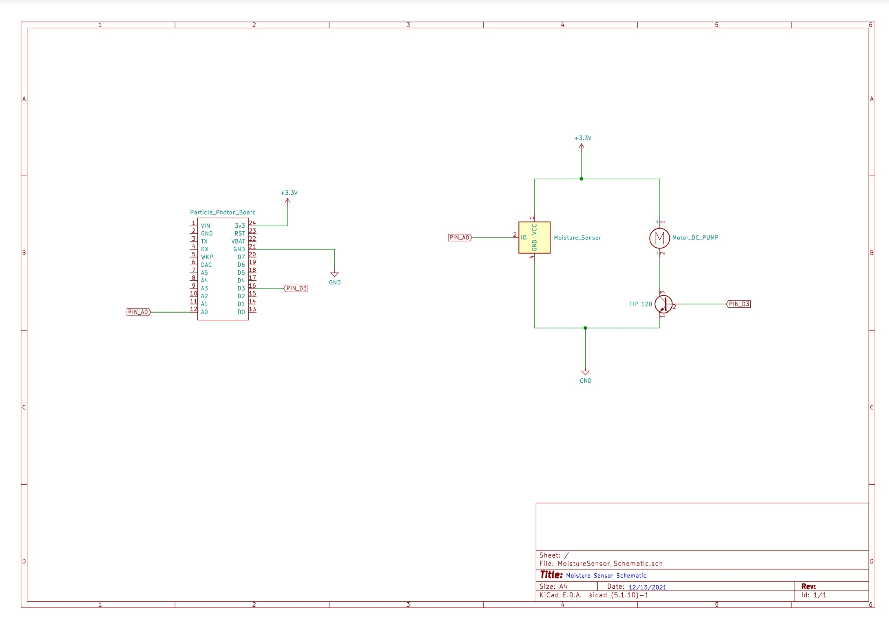

# EE1301 Final Project: Automatic Plant Watering

## Team Members: 
- Joe Moran		       &emsp; (moran481)
- Khanh Vo		       &emsp; (vo000060) 
- Michael Duthie	   &emsp; (duthi008)
- Chloe Cho		       &emsp; (cho00035)
- Yunho Chang		     &emsp; (chan2165)
- William Dahlke     &emsp; (dahlk117)    	 

## Project Description
Our plant watering device measures soil moisture using a soil moisture sensor. If the soil moisture gets below a certain level then the program will activate a water pump. This then allows the flow of water to go to the soil. Once the moisture sensor reads the moisture to be adequate, the program then stops the water pump after 1 second. There is a time interval of 30 minutes before the pump automatically waters the plant again. The user then will be able to track the moisture levels from your webpage throughout the day. There is also an option on the webpage to water the plant manually. There are different options of how long the water pump runs for on the webpage as well. 

## Project Files
- MoistureSensor/src (main directory)
  - MoistureSensor.ino
  - moisture.html

## Hardware Components (Part Numbers)
- Soil Moisture Sensor (SEN-13322)
- Submersible Water Pump [Link to part](https://www.amazon.com/MOUNTAIN_ARK-Submersible-Amphibious-Hydroponic-Fountains/dp/B010LY7P3Y/ref=asc_df_B010LY7P3Y/?tag=hyprod-20&linkCode=df0&hvadid=198074289969&hvpos=&hvnetw=g&hvrand=16963616822432394311&hvpone=&hvptwo=&hvqmt=&hvdev=c&hvdvcmdl=&hvlocint=&hvlocphy=9019667&hvtargid=pla-319030373214&psc=1)

## Circuit Diagram

